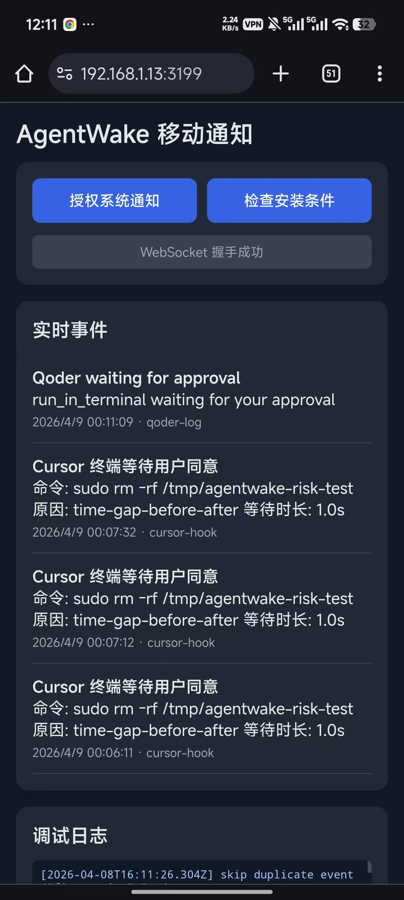
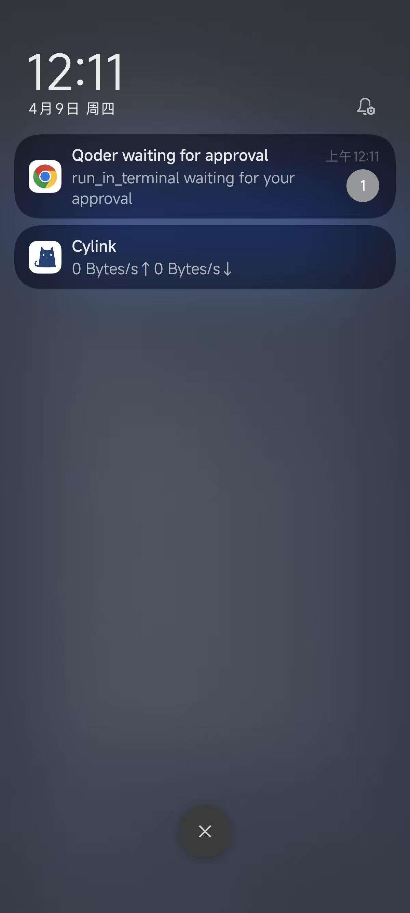
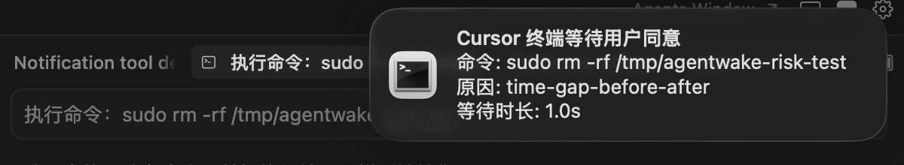
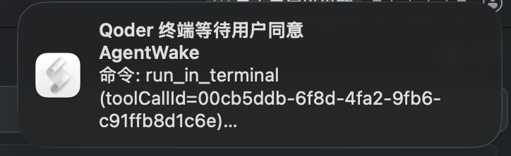
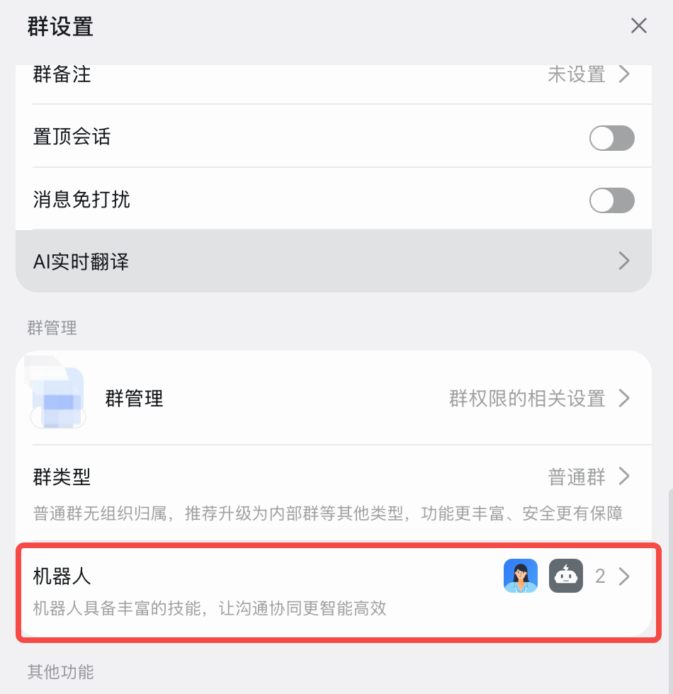
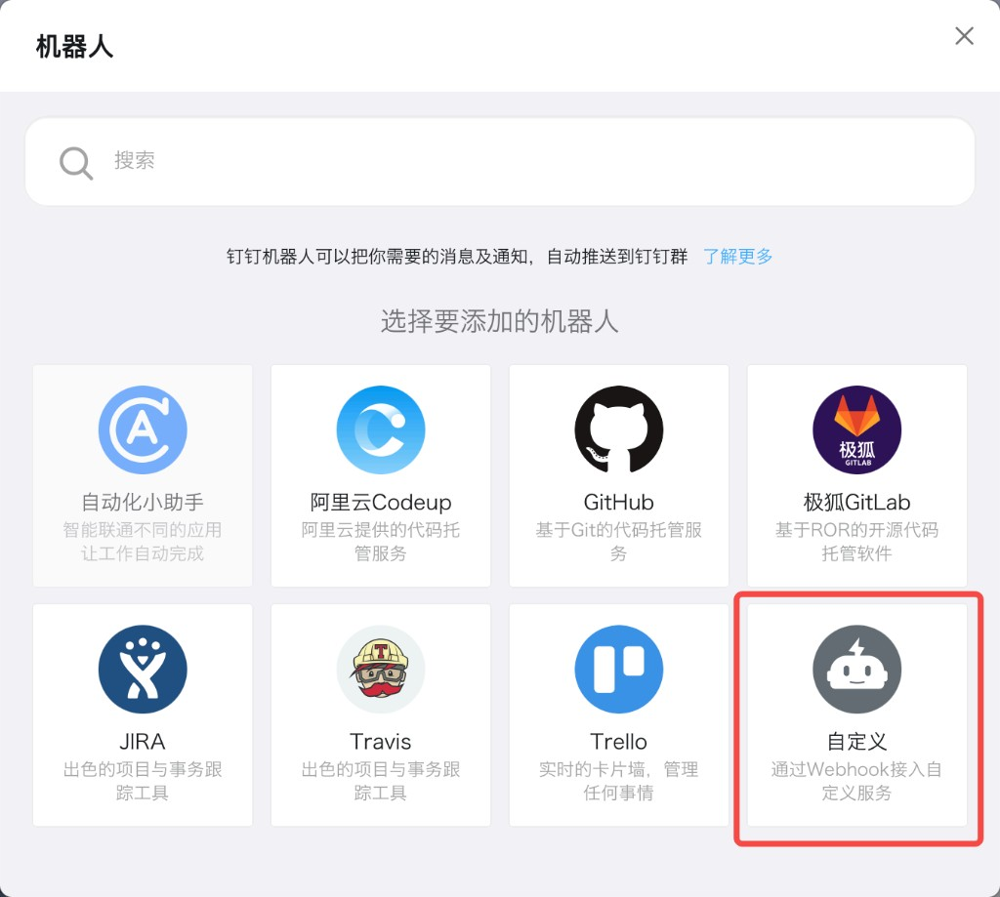
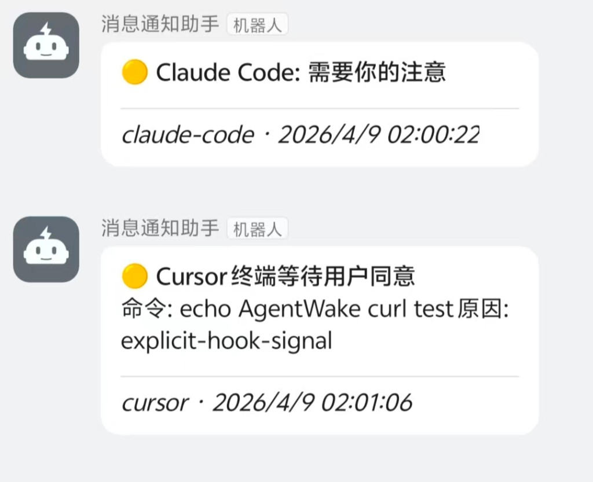

# AgentWake

English | [简体中文](README.zh-CN.md)

A cross-editor AI programming notification gateway. Supports Cursor / Claude Code / Qoder. Real-time push notifications to desktop, mobile, and IM groups when AI tasks are completed, abnormally terminated, or waiting for authorization.

## Preview

<p align="center">
  
  
</p>

<p align="center">
  
  
</p>

---

## Core Features

- **Multi-editor Support** — Cursor Hook, Claude Code Hook, Qoder log listening
- **Multi-channel Notifications** — Desktop system notifications, PWA web push, DingTalk, Feishu, WeCom
- **Claude Code Deep Integration** — Supports all Hook events like Stop / Notification / StopFailure / SessionEnd, customizable notification titles for each event
- **Mobile Real-time Push** — Built-in PWA Web App, HTTPS + WebSocket millisecond push, supports QR code connection
- **Smart Anti-disturbance** — Event deduplication + rate limiting to prevent message bombing
- **Interactive Configuration** — `agentwake setup` guides you through all configurations step by step

---

## Quick Start

### Prerequisites

- Node.js >= 18
- [mkcert](https://github.com/FiloSottile/mkcert) (Generates local HTTPS certificates, required for mobile push)

### Installation

```bash
npm i -g agentwake
```

### Method 1: Interactive Guide (Recommended)

```bash
agentwake setup    # Interactive setup (~/.agentwake/.env, HTTPS/mkcert, Cursor hooks, Claude hooks, channels, …)
```

`setup` will guide you through:
1. Whether to enable HTTPS (optional mkcert certificates)
2. Select AI tools (Claude Code / Cursor / Qoder)
3. Select event types to listen to (Claude)
4. Customize notification titles for each event (optional)
5. Select notification channels (DingTalk / Feishu / WeCom / PWA)
6. Enter Webhook URLs and secrets (if applicable)
7. Write Cursor `.cursor/hooks.json` (if Cursor selected), install Claude Code hooks (if Claude selected)
8. Start the service (optional)

### Method 2: Manual Configuration

```bash
# Edit ~/.agentwake/.env manually (you can copy from the repo’s .env.example)
# Fill in values, then:
agentwake start
```

All data is stored in the `~/.agentwake/` directory, no need to create a working directory manually.

### Method 3: Start from Source

```bash
git clone https://github.com/tjdxwwj/agentwake.git
cd agentwake
npm install

# Interactive setup (.env, optional mkcert, hooks)
npm run setup

# Start development server
npm run dev
```

After starting, the service runs at `https://localhost:3199`.

---

## Notification Channels

| Channel | Configuration | Description |
|------|---------|------|
| Desktop Notification | Built-in, no config needed | macOS / Windows / Linux |
| PWA Web Push | Built-in, open service URL in mobile browser | Requires HTTPS, supports Service Worker system notifications |
| DingTalk | `AGENTWAKE_DINGTALK_WEBHOOK` | Group bot Webhook, supports signature verification |
| Feishu | `AGENTWAKE_FEISHU_WEBHOOK` | Group bot Webhook, supports signature verification |
| WeCom | `AGENTWAKE_WECOM_WEBHOOK` | Group bot Webhook, security guaranteed by URL Key |

### DingTalk Configuration

1. Open the DingTalk group → **Group settings** → **Bot** (机器人) → add or manage bots.
2. Choose **Custom** (自定义) — “Access custom services via Webhook”, then complete the wizard and copy the **Webhook URL** and optional **signing secret** (加签).

<p align="center">
  
</p>

<p align="center"><em>Group settings → Bot (机器人).</em></p>

<p align="center">
  
</p>

<p align="center"><em>Add robot → Custom — Webhook integration.</em></p>

```env
AGENTWAKE_DINGTALK_WEBHOOK=https://oapi.dingtalk.com/robot/send?access_token=xxx
AGENTWAKE_DINGTALK_SECRET=SECxxx   # Optional, signature secret
```

<p align="center">
  
</p>

<p align="center"><em>Example messages: Claude Code “needs your attention” and Cursor “waiting for user approval” (group bot on mobile).</em></p>

### Feishu Configuration

In Feishu Group -> Settings -> Bots -> Add Custom Bot, copy the Webhook URL.

```env
AGENTWAKE_FEISHU_WEBHOOK=https://open.feishu.cn/open-apis/bot/v2/hook/xxx
AGENTWAKE_FEISHU_SECRET=xxx   # Optional, signature verification secret
```

### WeCom Configuration

In WeCom Group -> Group Bots -> Add Group Bot, copy the Webhook URL.

```env
AGENTWAKE_WECOM_WEBHOOK=https://qyapi.weixin.qq.com/cgi-bin/webhook/send?key=xxx
```

---

## Editor Integration

### Claude Code

Running `agentwake setup` will automatically:
- Generate Hook relay script to `~/.agentwake/hooks/claude-hook-relay.sh`
- Write Hook configuration to `~/.claude/settings.json`

Supported Hook events:

| Event | Description | Enabled by Default |
|------|------|---------|
| Notification | Requires user attention | Yes |
| Stop | Task completed | Yes |
| StopFailure | Task terminated abnormally | Yes |
| SessionEnd | Session ended | Yes |
| SessionStart | Session started | No |
| PreToolUse | Before tool use | No |
| PostToolUse | After tool use | No |

### Cursor

1. Run `agentwake setup` at the project root and enable Cursor (writes `.cursor/hooks.json`)
2. Keep `agentwake start` running
3. Automatic notification when Cursor terminal triggers authorization wait

### Qoder

Automatically discover log directory, or specify manually:

```bash
AGENTWAKE_QODER_LOG_PATH="/path/to/agent.log" agentwake start
```

---

## Custom Notification Titles

Set interactively via `agentwake setup`, or configure directly in `.env`:

```env
AGENTWAKE_CLAUDE_TITLE_STOP=AI Done
AGENTWAKE_CLAUDE_TITLE_STOP_FAILURE=AI Failed
AGENTWAKE_CLAUDE_TITLE_NOTIFICATION=AI Needs Attention
AGENTWAKE_CLAUDE_TITLE_SESSION_END=Session Ended
```

Events without configured titles will use default titles.

---

## Mobile PWA Setup

Your phone needs to trust the local HTTPS certificate to receive Service Worker system notifications.

1. Get root certificate path: run `mkcert -CAROOT` to find `rootCA.pem`
2. Install on mobile:
   - **iOS** — Send to phone, install profile, then enable full trust in Settings > General > About > Certificate Trust Settings
   - **Android** — Install CA certificate in security settings (may need to rename extension to `.crt`)
3. Open `https://<LAN IP>:3199` in mobile browser, confirm HTTPS connection is secure and allow notification permissions

---

## All Environment Variables

| Variable | Default Value | Description |
|------|--------|------|
| `AGENTWAKE_HOST` | `0.0.0.0` | Listening address |
| `AGENTWAKE_PORT` | `3199` | Listening port |
| `AGENTWAKE_HTTPS_ENABLED` | `0` | Enable HTTPS (`1` to enable; mkcert can be run via `agentwake setup`) |
| `AGENTWAKE_HTTPS_CERT_PATH` | `certs/dev-cert.pem` | HTTPS certificate path |
| `AGENTWAKE_HTTPS_KEY_PATH` | `certs/dev-key.pem` | HTTPS private key path |
| `AGENTWAKE_CURSOR_ENABLED` | `1` | Enable Cursor hook adapter (`0` to disable) |
| `AGENTWAKE_CLAUDE_ENABLED` | `1` | Enable Claude hook adapter (`0` to disable) |
| `AGENTWAKE_QODER_ENABLED` | `1` | Enable Qoder log adapter (`0` to disable) |
| `AGENTWAKE_DESKTOP_ENABLED` | `1` | Enable desktop system notifications (`0` to disable) |
| `AGENTWAKE_PWA_ENABLED` | `0` | Enable PWA/WebSocket push (`1` to enable; HTTPS recommended for mobile push) |
| `AGENTWAKE_DINGTALK_ENABLED` | `1` | Enable DingTalk notifications (`0` to disable) |
| `AGENTWAKE_DINGTALK_WEBHOOK` | — | DingTalk Webhook URL |
| `AGENTWAKE_DINGTALK_SECRET` | — | DingTalk signature secret |
| `AGENTWAKE_FEISHU_ENABLED` | `1` | Enable Feishu notifications (`0` to disable) |
| `AGENTWAKE_FEISHU_WEBHOOK` | — | Feishu Webhook URL |
| `AGENTWAKE_FEISHU_SECRET` | — | Feishu signature secret |
| `AGENTWAKE_WECOM_ENABLED` | `1` | Enable WeCom notifications (`0` to disable) |
| `AGENTWAKE_WECOM_WEBHOOK` | — | WeCom Webhook URL |
| `AGENTWAKE_CLAUDE_TITLE_*` | — | Claude event custom titles |
| `AGENTWAKE_DEDUPE_WINDOW_MS` | `10000` | Deduplication window (ms) |
| `AGENTWAKE_RATE_LIMIT_WINDOW_MS` | `10000` | Rate limit window (ms) |
| `AGENTWAKE_RATE_LIMIT_MAX_EVENTS` | `40` | Max events within window |
| `AGENTWAKE_WS_PATH` | `/ws` | WebSocket path |
| `AGENTWAKE_QODER_LOG_PATH` | — | Qoder log path (auto-discovered) |
| `AGENTWAKE_ALLOWED_HOOK_IPS` | — | Limit Hook source IPs (comma-separated) |

---

## Development

```bash
git clone https://github.com/tjdxwwj/agentwake.git
cd agentwake
npm install
npm run setup    # Interactive ~/.agentwake/.env, optional mkcert
npm run dev      # Start development server
npm test         # Run tests
```

### Directory Structure

```
src/
  adapters/       # Input adapters (Cursor / Claude / Qoder)
  gateway/        # Core gateway (Adapter registration, event routing)
  notifiers/      # Notification dispatchers (Desktop / WebSocket / DingTalk / Feishu / WeCom)
  installers/     # Hook auto-installers
web/              # PWA frontend
```

### Tech Stack

Node.js + TypeScript + Express + WebSocket (ws) + Zod

---

## FAQ

**Cannot receive notifications on mobile?**
1. Ensure phone and computer are on the same LAN
2. Ensure browser shows secure HTTPS connection (not "Not Secure")
3. Ensure notification permissions are granted
4. Check if Web page WebSocket status is "Connected"

**How to change port?**
```bash
AGENTWAKE_PORT=4000 agentwake start
```

**Can personal WeChat receive notifications?**
WeChat does not support Webhook message push API. You can use WeCom group bots as an alternative.

---

## Contributors

- [@tjdxwwj](https://github.com/tjdxwwj)
- [@qiangguanglin](https://github.com/qiangguanglin)

---

MIT License
